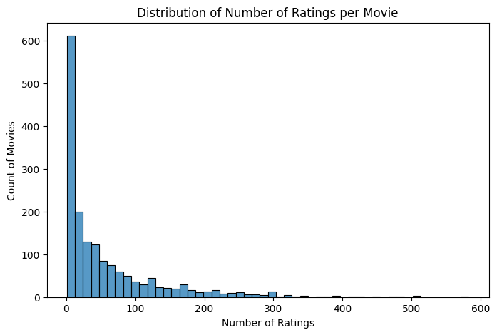
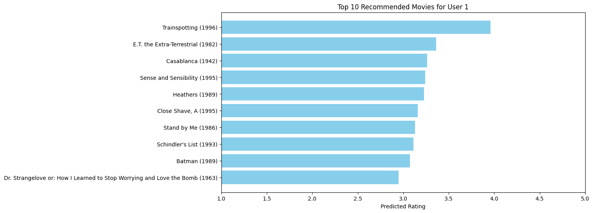
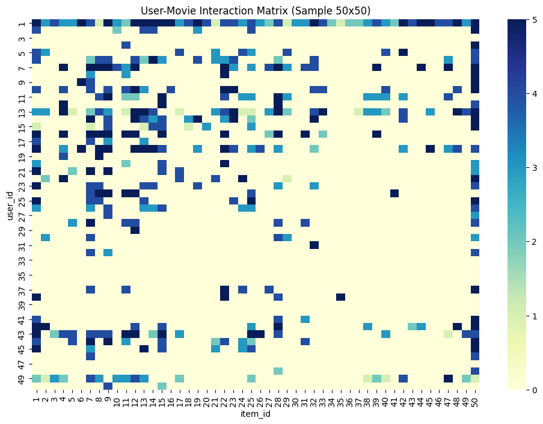
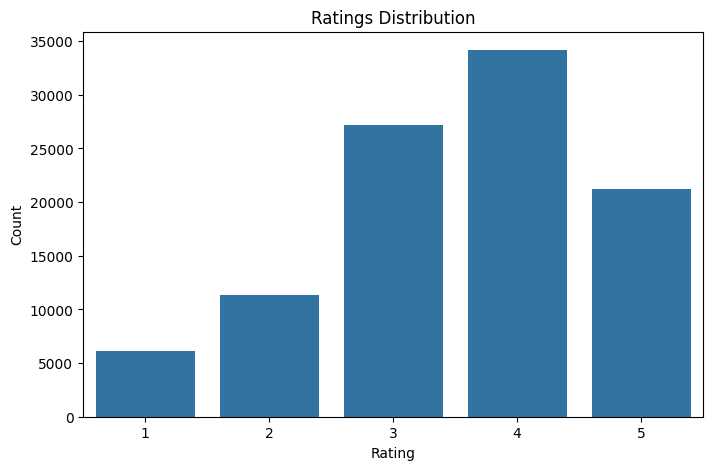
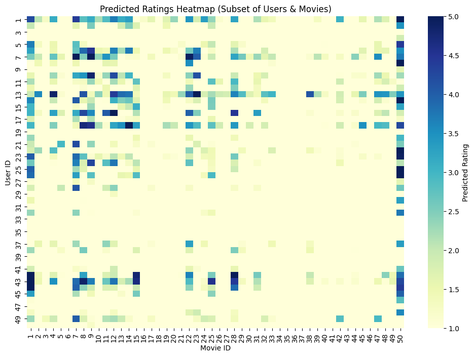

# 🎬 Movie Recommendation System


## Overview
This project implements a **movie recommendation system** using the **MovieLens 100k dataset**. The system provides personalized movie suggestions using **popularity-based methods, collaborative filtering, and matrix factorization (SVD)**.  

It demonstrates an **end-to-end workflow**:  
**Data Analysis → Modeling → Evaluation → Visualization → Deployment.**

## 🚀 Live Dashboard

<p align="center">
  <a href="https://recommendation-system-case-study-dtds8hweqwj5uxwnwsgex3.streamlit.app/" target="_blank">
    
  </a>
</p>


## 🌐 Connect with Me

<p align="center">
  <a href="https://your-portfolio-website.com" target="_blank">
    
  </a>
  &nbsp;&nbsp;
  <a href="https://www.linkedin.com/in/your-linkedin-profile/" target="_blank">
    
  </a>
</p>

---

## Dataset
- **Source:** [MovieLens 100k](https://grouplens.org/datasets/movielens/100k/)  
- **Size:** 100,000 ratings from 943 users on 1,682 movies  
- **Key Features:**
  - `user_id` – unique identifier for each user
  - `item_id` – unique identifier for each movie
  - `rating` – user rating (1–5)
  - `timestamp` – date/time of rating
  - `title` – movie title
  - `genres` – movie genre(s)

---

## Project Roadmap

### 1️⃣ Data Understanding & Setup
- Loaded dataset in **Jupyter Notebook (VSCode)**.
- Explored **ratings, users, and movies**.
- Handled **missing values** and **duplicates**.

### 2️⃣ Exploratory Data Analysis (EDA)
- Ratings distribution (1–5 stars).
- Most-rated movies and most active users.
- Sparsity of the user-item matrix.
- **Visualizations**:

**Ratings Distribution**  


**Top 10 Most Rated Movies**  


**User-Movie Interaction Heatmap**  


### 3️⃣ Recommendation Models
- **Popularity-Based Recommender**  
  - Recommends top-rated / most-watched movies.  

- **Collaborative Filtering**  
  - **User-based similarity**  
  - **Item-based similarity**

- **Matrix Factorization (SVD)**  
  - Predicted missing ratings using `TruncatedSVD`  
  - Evaluation metrics: **RMSE & MAE**

---

### 4️⃣ Evaluation
| Model | Train RMSE | Train MAE | Test RMSE | Test MAE |
|-------|-----------|-----------|-----------|----------|
| SVD   | 0.6444    | 0.2826    | 0.6637    | 0.2828   |

**Insights:**  
- Most users give **5-star ratings**.  
- Popular movies dominate recommendations (e.g., *Star Wars*, *Fargo*).  
- Collaborative filtering personalizes beyond popularity-based lists.  
- SVD improves prediction accuracy.

---

### 5️⃣ Recommendations Examples
**Top 10 recommended movies for User 1 (SVD):**
1. Sense and Sensibility (1995)  
2. Schindler's List (1993)  
3. Batman (1989)  
4. Close Shave, A (1995)  
5. E.T. the Extra-Terrestrial (1982)  
6. Heathers (1989)  
7. Dr. Strangelove or: How I Learned to Stop Worrying and Love the Bomb (1963)  
8. Trainspotting (1996)  
9. Casablanca (1942)  
10. Stand by Me (1986)  

**Popularity-Based Top 10 Movies:**  


---

### 6️⃣ Visualization
**Example: Rating distribution by movie popularity**  


**User-Item Matrix Heatmap**  


---

### 7️⃣ Deployment (Optional)
- Deployed as a **Streamlit app** for interactive movie recommendations.  
- Users can enter their **user ID** to see **top-N recommendations**.  
- Includes filters by **genre, rating, or popularity**.

---

## How to Run

1. Clone the repository:
```bash
git clone <[your-repo-url](https://github.com/Ayolalekan/recommendation-system-case-study)>
```
Install dependencies:
```
pip install -r requirements.txt
```

Run Jupyter Notebook:
```
jupyter notebook
```

Optional: Run Streamlit app:
```
streamlit run app.py
```
## Future Work / Extensions

- Hybrid models combining content + collaborative filtering

- Session-based / sequence-aware recommendations using RNN/Transformer

- Real-time recommendation system for larger datasets

- Integrate review text sentiment analysis for NLP-based personalization

## Technologies Used

Python 3.x

Pandas, NumPy, Matplotlib, Seaborn

Scikit-learn (TruncatedSVD)

Jupyter Notebook

(Optional) Streamlit for deployment

## License

This project is for educational and portfolio purposes.
